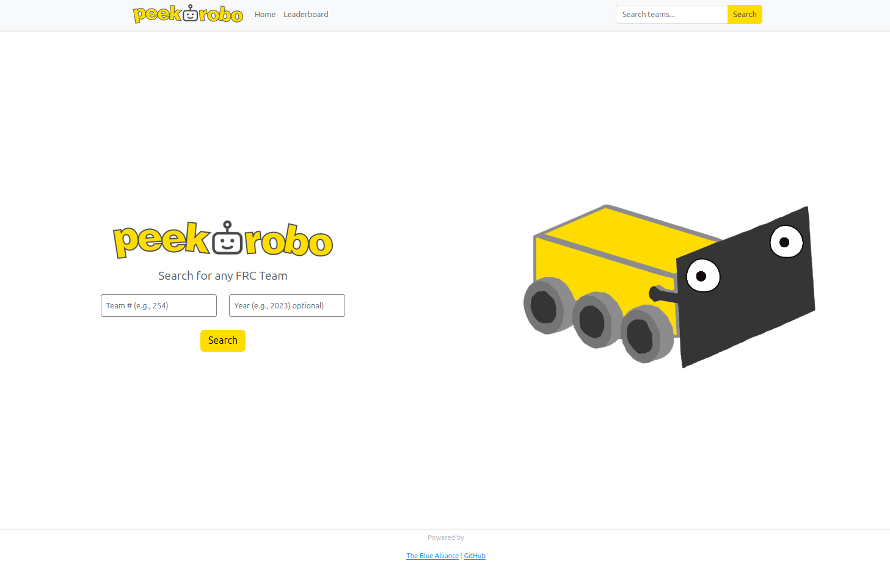
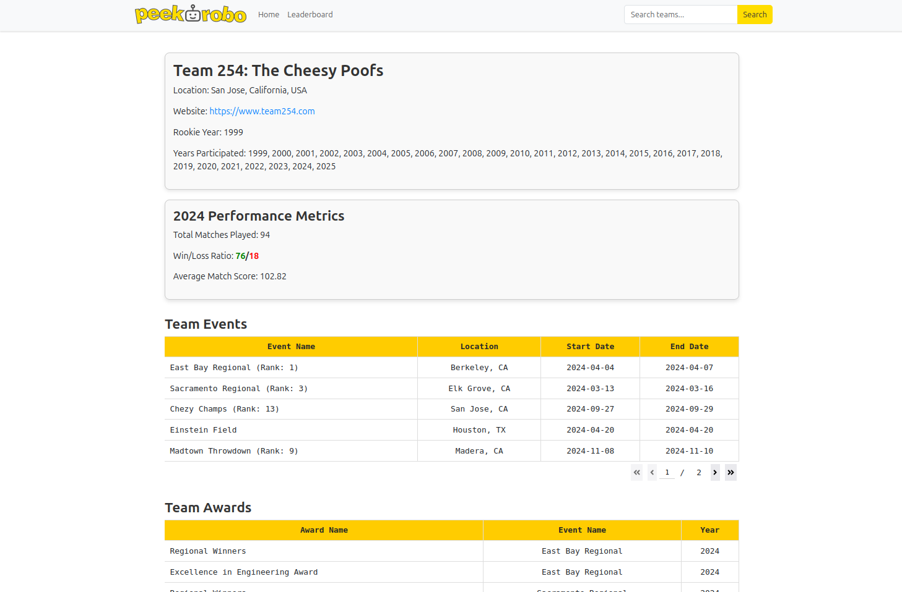
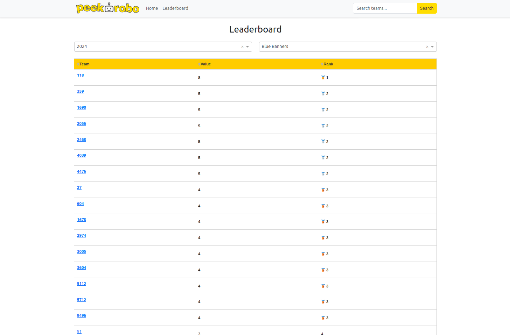

This project is a web application built with [Dash](https://dash.plotly.com/) to display detailed information about FRC (FIRST Robotics Competition) teams and events. It uses the [The Blue Alliance (TBA) API](https://www.thebluealliance.com/apidocs/v3) to fetch and display data.

## Features

- **Search Functionality**: Search for teams using their team number.
- **Team Profile Pages**: Displays detailed information about a specific team's:
  - Basic details (name, location, rookie year, etc.).
  - Performance metrics (win/loss ratio, average match score, etc.).
  - Events participated in, including rankings.
  - Awards won.
- **Leaderboard Page**: View team rankings by various metrics.











## **Running the Application**

Run the Python script to launch the dashboard:

```bash
python peekorobo.py
```

Or you can visit the Render Development Build here:

https://aurora-vens.onrender.com/

## **License**

This project is licensed under the **MIT License**. See the LICENSE file for details.

Copyright (c) 2024 Rhett R. Adam

---