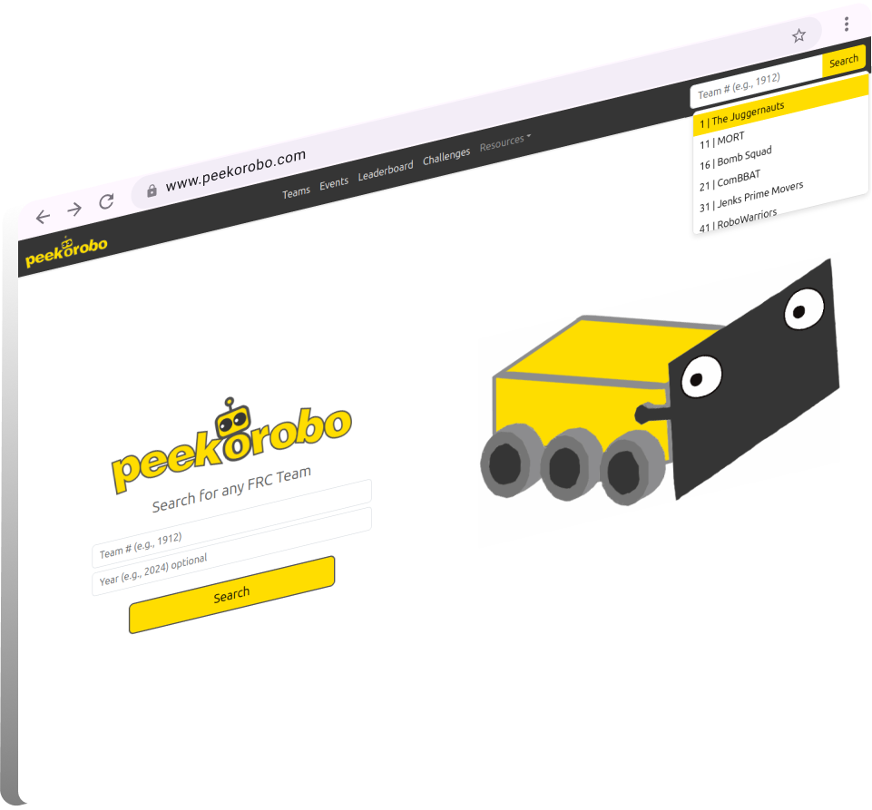
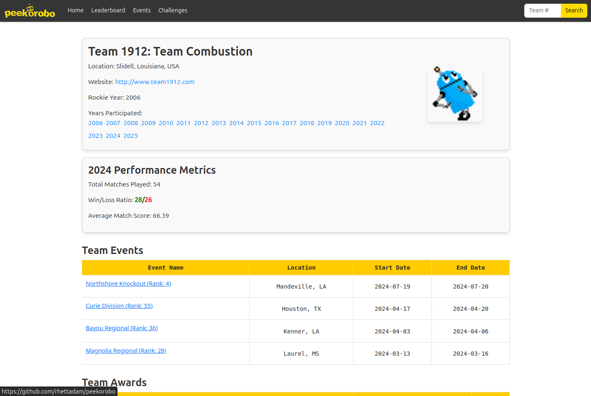
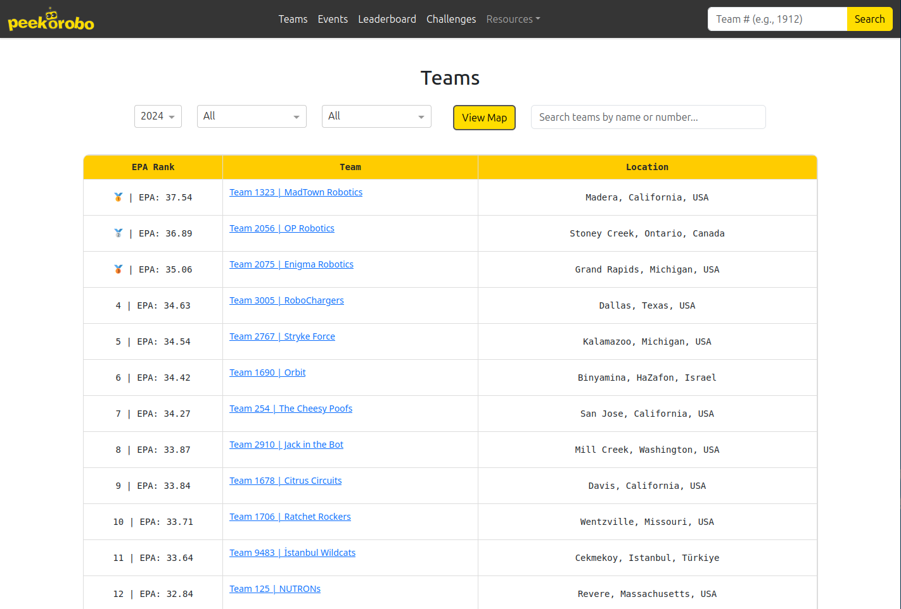
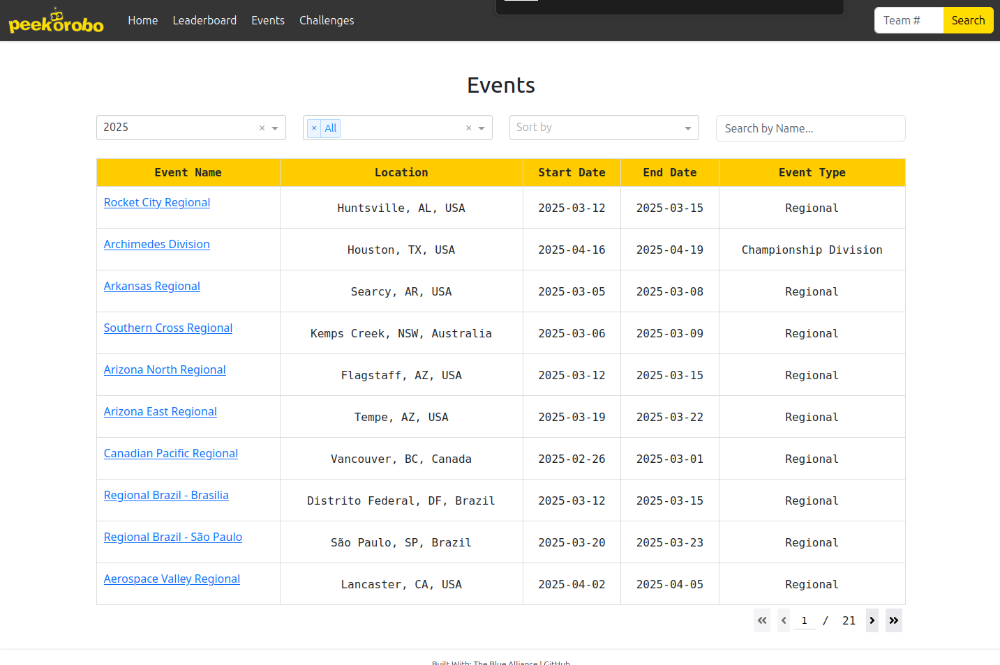
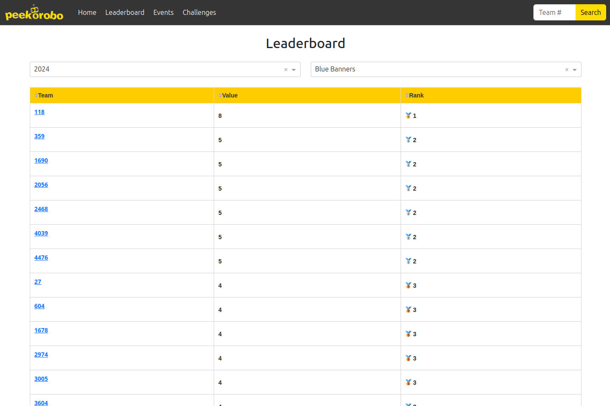
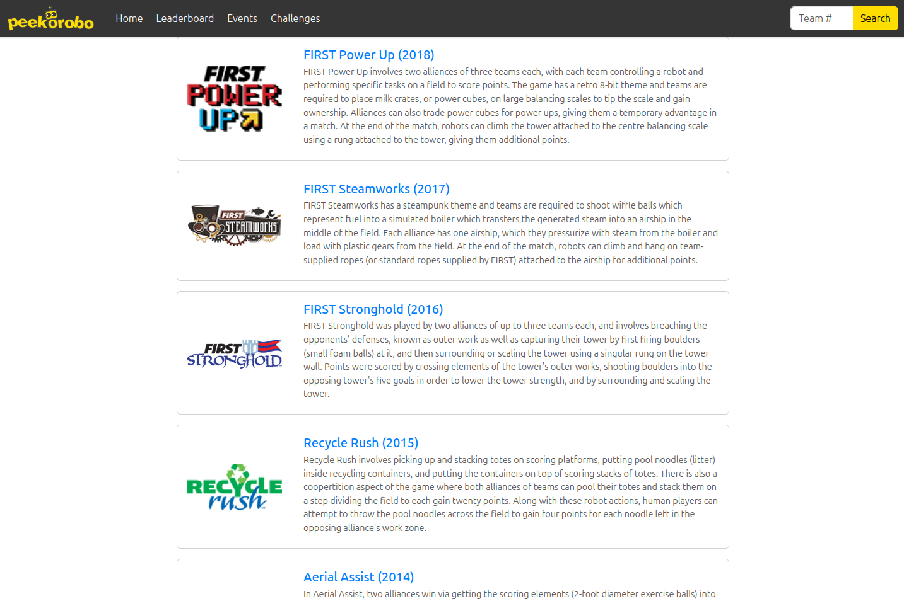

### **Peekorobo is a web application for analysing FRC team performance metrics, leveraging data from The Blue Alliance (TBA) to provide insights into team rankings, match performance, and historical trends.**

---

## Features

### 1. **Team Profiles**



    General Info
        - Team name and number
        - Location (city, state, country)
        - Rookie year
        - Years participated
        - Team website
        - Team avatars
    
    Performance Metrics
        - Global rank
        - Country rank
        - State rank
        - EPA (Expected Points Added)
        - Win/Loss ratio
        - Average match score
     
    Events & Awards
        - Team Events Table
            - Event Name
            - Year
            - Event Dates
            - TBA links
        - Team Awards Table
            - Award name
            - Event name
            
### 2. **Team Dictionary**



    General Info
        - Team name and number
        - Location (City, State, Country)

    Rankings
        - Ranked by mean EPA
        - Years before 2001 have no metrics

    Filters
        - Filter by year, country, and/or state
        - Interactive search bar

    Team Map
        - Map of all registered 2025 teams
        - Interactive and navigational
        
### 3. **Events Dictionary**



    General Info
        - Event name
        - Event website
        - Event location (city, state, country)
        - Event type (Regional, District, Championship, Season, Off-Season)
        
    Filters
        - Filter by year, event type, week, or name.
        - Sort by date or name
        
    Event Map
        - Interactive map of all FRC events
        - Dynamically updates according to filters
    
### 4. **Leaderboard**



    Filters
        - Sort by year
        - Metrics:
            - Blue Banners
            - Most Matches Played
            - Highest Median Score by Event
            - Highest Match Clean Score
            - Highest Match Clean Combined Score
            - Most Awards
            - Most Non-Champs Event Wins
            - Most Unique Teams Played With Against
            
    Rankings
        - Clickable team links
        - Ranks with medals

### 5. **Challenge Dictionary**



    - Dictionary of FRC challenges from 1992-2025
    
    - Includes:
        - Challenge name, year, and logo
        - Challenge summary
        - Game manual
        - Game reveal video  

---

## Tech Stack

### Backend
- **Python**
- **Flask**: Handles the server-side operations and routing.
- **Heroku**: Platform for deploying Peekorobo.
- **The Blue Alliance API**: Used for fetching data about teams, events, and awards.
  **JSON Files**: Store pre-fetched team data and calculated EPA locally (see /geo and /team_data)

### Frontend
- **Dash**: Framework for building the web application.
- **Plotly**: Generates dynamic and interactive plots.

---

## Setup

### Local Installation
1. Clone the repository:
   ```bash
   git clone https://github.com/username/peekorobo.git
   cd peekorobo
   ```

2. Install dependencies:
   ```bash
   pip install -r requirements.txt
   ```

3. Set up environment variables:
   - Create a `.env` file in the root directory.
   - Add your TBA API key:
     ```env
     TBA_API_KEY=your_api_key_here
     ```

4. Run the application:
   ```bash
   python app.py
   ```

5. Access the app in your browser at `http://127.0.0.1:8050`.

### Heroku Development Build
You can visit the Heroku Development Build here:

https://peekorobo-6ec491b9fec0.h

---

## **License**

Peekorobo is licensed under the **MIT License**. See the LICENSE file for details.

Copyright (c) 2024 Rhett R. Adam

---