# Peekorobo

Data-driven scouting and analysis for the [FIRST Robotics Competition](https://www.firstinspires.org/robotics/frc). Peekorobo aggregates The Blue Alliance data, computes **ACE** (Adjusted Contribution Estimate) ratings, and serves them through a fast React app — teams, events, matches, maps, insights, and more.

**Live:** [peekorobo.pages.dev](https://peekorobo.pages.dev/) · **API:** [peekorobo-api.onrender.com](https://peekorobo-api.onrender.com/docs)

---

## Table of contents

1. [Features](#features)
2. [ACE algorithm](#ace-algorithm)
3. [Architecture & stack](#architecture--stack)
4. [Data pipeline](#data-pipeline)
5. [Local development](#local-development)
6. [Deployment](#deployment)
7. [Screenshots](#screenshots)
8. [License](#license)

---

## Features

### Home

Global search for teams and events (year-aware event matching), plus quick links into Teams and Events.

<!-- Screenshot: Home -->
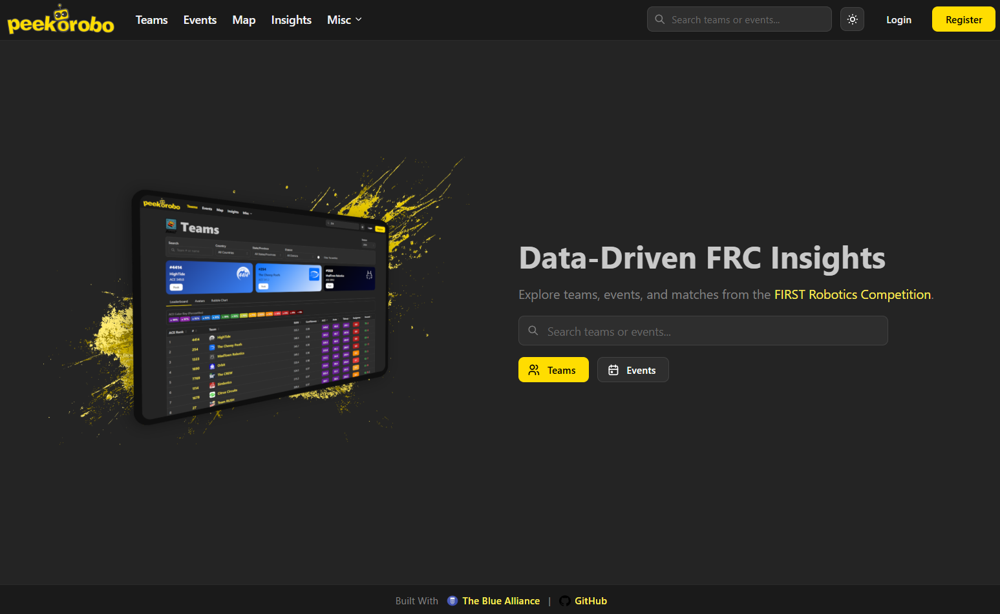

### Teams leaderboard

Browse every team for a season with:

- **Leaderboard** — sortable/paginated table (ACE, RAW, phase scores, record, ranks); export CSV/JSON; shareable URL filters (`year`, `country`, `state`, `district`)
- **Avatars** — grid of team avatars
- **Bubble chart** — configurable X/Y/color metrics, quantile bands, median lines, tooltips
- Fast first paint (top ~100), then full-season load on filter/pagination
- Top teams spotlight, game logo header, ACE percentile color key

<!-- Screenshot: Teams leaderboard -->
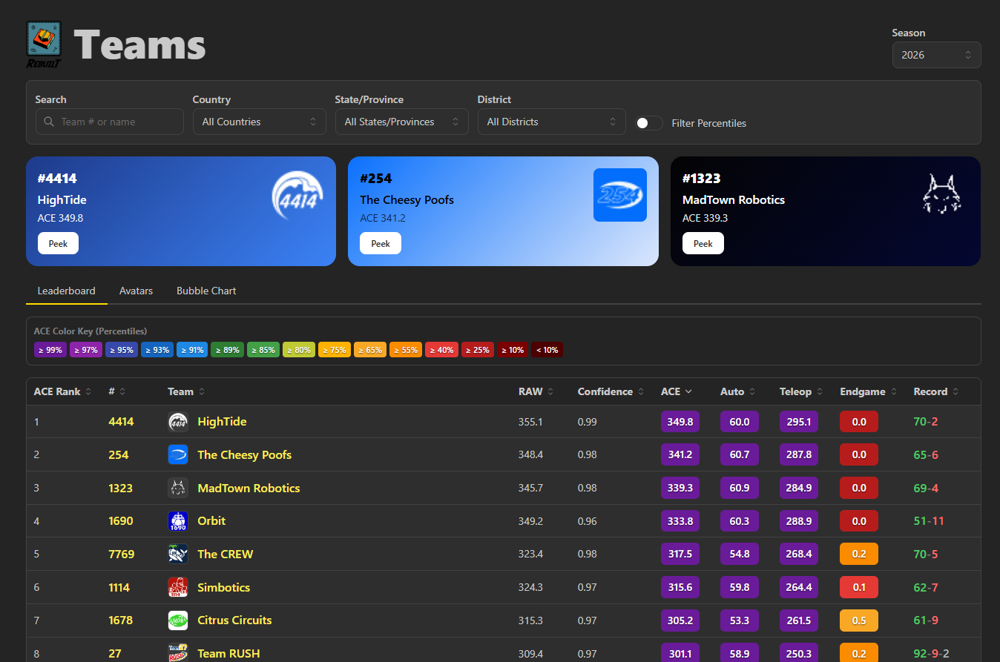

<!-- Screenshot: Teams bubble chart -->
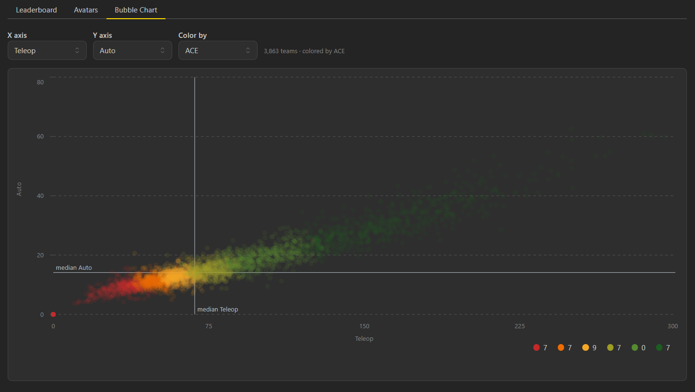

### Team profile

Per-season team page (`/team/:number/:year`) with:

- Header gradient from team colors, avatar, notables (e.g. Hall of Fame / championship impact)
- Rank cards (global / country / state / district) linking to filtered leaderboards
- Links to TBA, Statbotics, and official FRC
- Season selector and career **History** page
- Tabs: **Overview** (ACE/RAW pills, recent events, performance chart), **Events**, **Awards** (blue banners first, then other awards)

<!-- Screenshot: Team profile -->
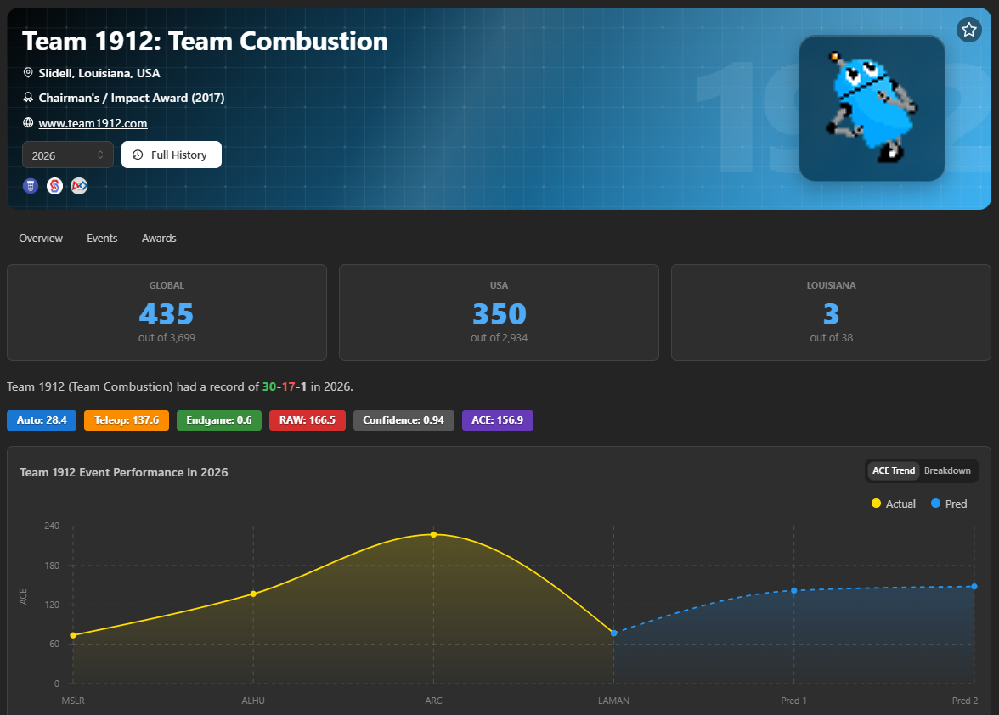

### Team history

Career view (`/team/:number/history`): summary stats, blue banners wall, global rank-by-season chart (ACE in hover — rank is comparable across years; ACE units are not).

<!-- Screenshot: Team history -->
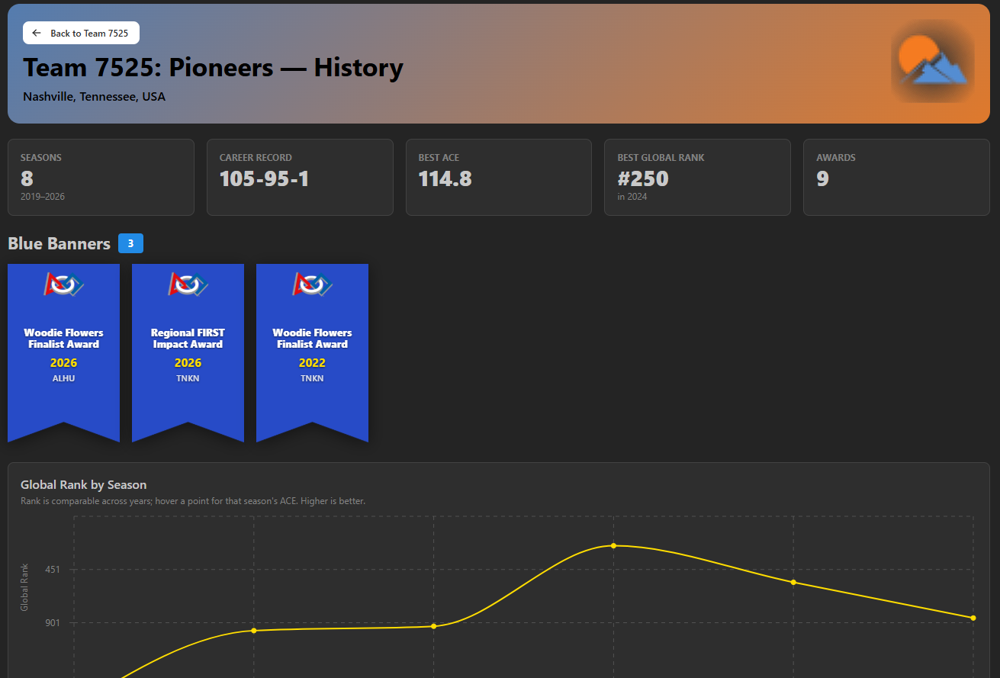

### Events browser

Season event list with week / type / district filters, shareable URLs, game-logo header, and an **Event Metrics** tab with season-wide event statistics.

<!-- Screenshot: Events -->
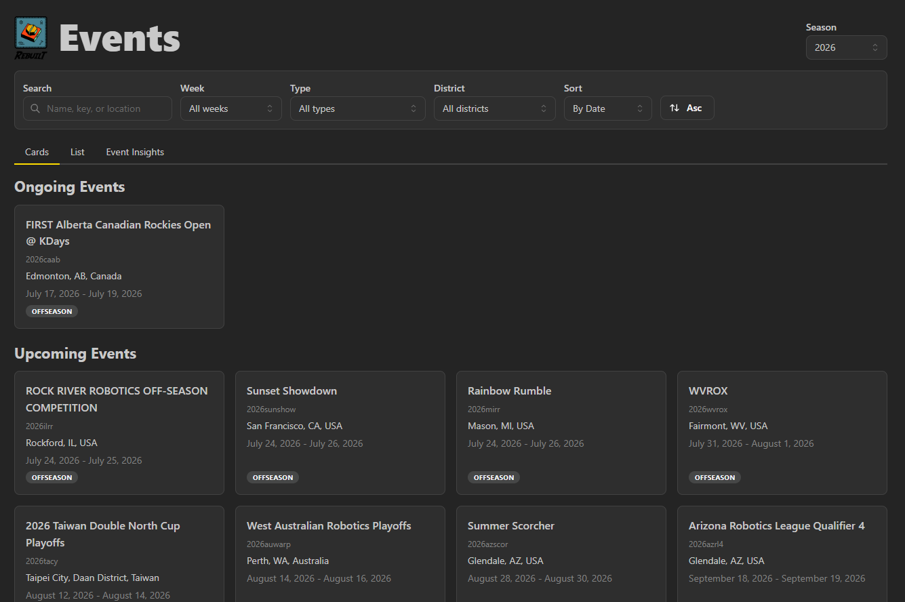

### Event detail

Event page (`/event/:key`) tabs:

| Tab | Contents |
|-----|----------|
| **Teams** | Event roster with ACE and records |
| **Metrics** | Per-team ACE/RAW/auto/teleop/endgame; toggle event vs season metrics |
| **Matches** | Qual + playoff tables (paginated), colored W-L-T |
| **SoS** | Strength of schedule (client-side from matches + event ACE) |
| **Rankings** | Qual rankings (W/L/T/DQ, ACE, event ACE rank) + playoff bracket |
| **Awards** | Grouped award cards |

<!-- Screenshot: Event detail -->
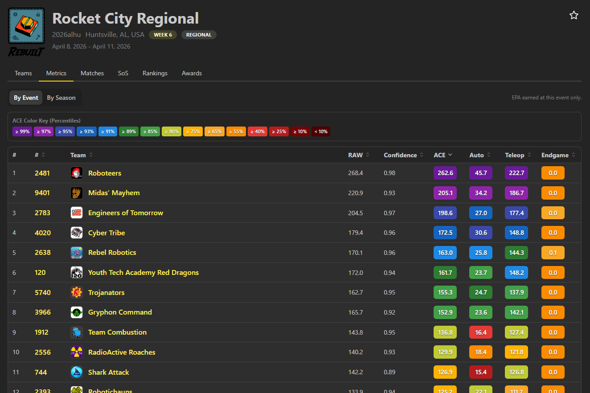

### Match detail

Alliance breakdown, scores, win probabilities (when available), navigation to adjacent matches, team number links (not names in tables).

<!-- Screenshot: Match -->
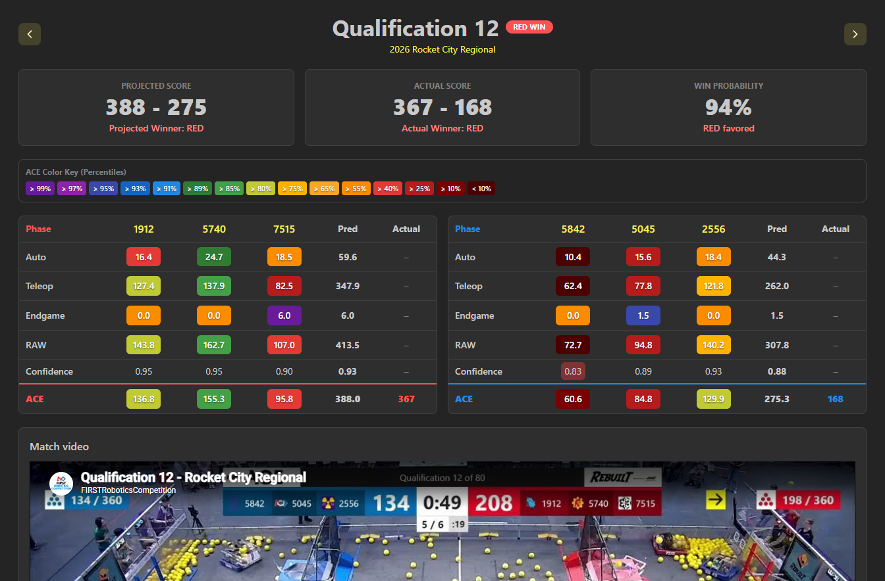

### Map

Full-bleed interactive map (MapLibre GL):

- Team avatar markers + event markers (by type)
- Optional heatmap and district boundaries
- 2D ⇄ 3D globe toggle
- Search to fly to a team or event
- Collapsible layer controls

<!-- Screenshot: Map -->
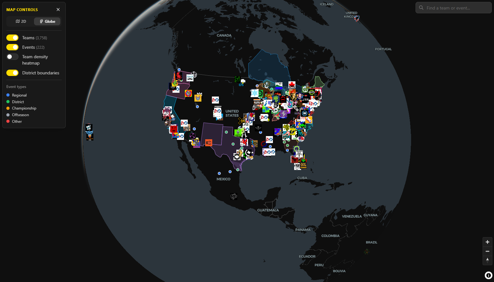

### Compare

Side-by-side team comparison for a chosen year (metrics, records, ranks).

<!-- Screenshot: Compare -->
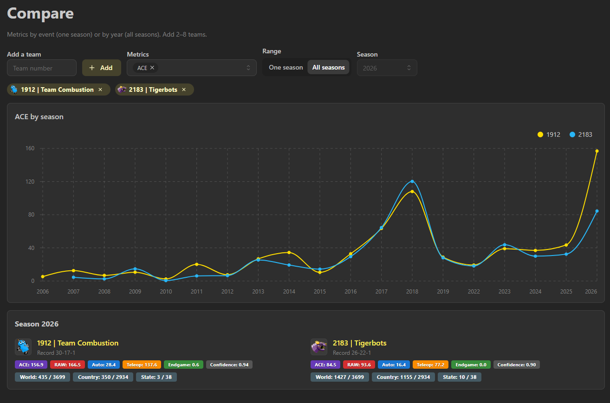

### Insights

Season cards landing page → per-year insights: game info, manuals/reveal links when available, leaderboards and season summaries.

<!-- Screenshot: Insights -->
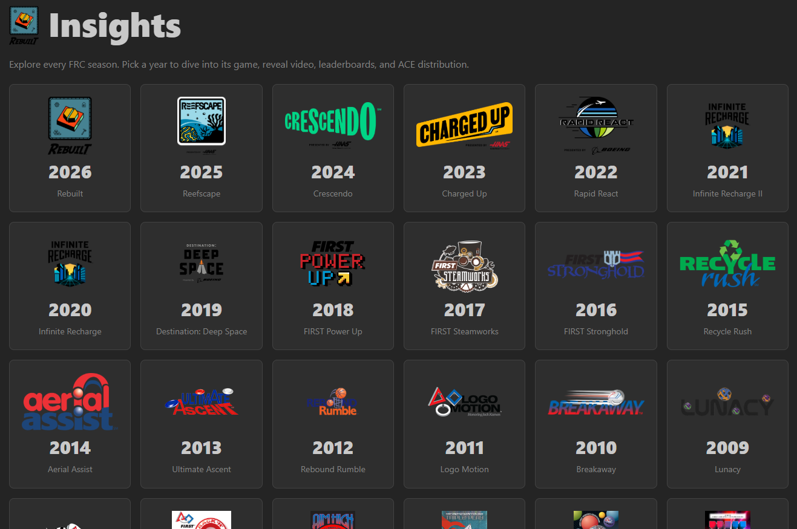

### Accounts & social

Register / login (JWT), profile page with avatar gallery, favorites, follows, API key management, and public user profiles.

<!-- Screenshot: Profile -->
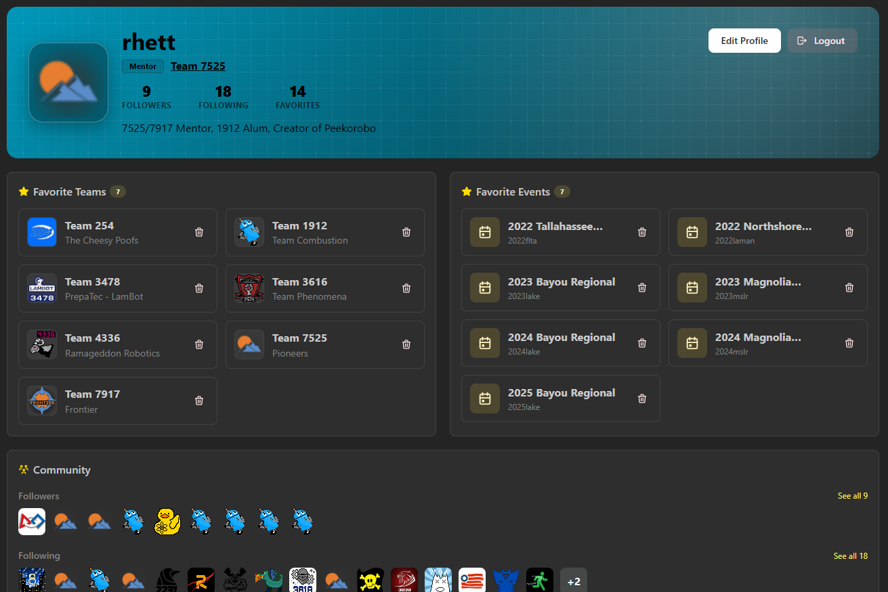

### Blue banners

Chairman's / Impact, Winner, and Woodie Flowers awards are classified robustly (messy TBA names) and shown as a banner wall before ordinary awards.

---

## ACE algorithm

**ACE** (Adjusted Contribution Estimate) is Peekorobo’s contribution rating:

\[
\text{ACE} = \text{RAW} \times \text{confidence}
\]

RAW estimates how many points a team contributes; confidence scales that by how trustworthy the estimate is. Implementation lives in [`data/run.py`](data/run.py) with year-specific scorers in [`data/yearmodels.py`](data/yearmodels.py).

### 1. Per-event RAW

For each event a team plays:

1. Walk matches in time order.
2. From each match’s TBA `score_breakdown`, year-specific functions estimate the team’s **auto / teleop / endgame** contribution.
3. Update running RAW with a learning-rate style update (match importance × early-season decay; damp large positive spikes).
4. Track per-match contributions and dominance margins for confidence.

Legacy years (no breakdown) fall back to scaled alliance scores.

### 2. Per-event confidence

Confidence mixes five components (weights in `CONFIDENCE_WEIGHTS`):

| Component | Weight | Meaning |
|-----------|--------|---------|
| **Consistency** | 0.35 | Low spread of per-match contributions vs peak |
| **Dominance** | 0.35 | Score margin vs opponent (adjusted if “carried”) |
| **Record alignment** | 0.10 | Win rate scaled into \[0.5, 1\] |
| **Veteran** | 0.10 | Years of FRC experience |
| **Events** | 0.10 | Boost from number of played events this season (1→0.5, 2→0.8, 3+→1.0) |

Then non-linear scaling: high confidence slightly boosted, low confidence reduced, result capped to \[0, 1\].

**Event ACE** = event RAW × event confidence.

### 3. Season aggregate

Across a team’s events:

1. Drop empty / zero-RAW events.
2. Weight each event by **chronological weight × match count** (early season discounted, late season emphasized).
3. Season RAW = weighted mean of event RAWs (and phase RAWs).
4. Rebuild season confidence from weighted-mean components + the same non-linear scaling.
5. **Season ACE** = season RAW × season confidence.
6. W / L / T are summed across events.

If a team has no matches yet in the current year, season stats can fall back to the previous year.

### 4. Ranks & predictions

- Ranks (global / country / state / district) are computed from season ACE for all teams in the year.
- Unplayed matches get red/blue win probabilities from current ACE + confidence.

### 5. Incremental runs

`--active-only` recomputes teams at currently active events (full season for those teams, identical math to a full run) and leaves everyone else untouched. Ranks and predictions still refresh over the full set. Full recomputes stay on the 6h / daily schedule.

---

## Architecture & stack

```
The Blue Alliance
      │
      ▼
GitHub Actions  ──ACE pipeline──►  Neon Postgres
      │                                    │
      │ static JSON + assets               │
      ▼                                    ▼
Cloudflare Pages ◄──── React SPA ──── FastAPI (Render)
   (SPA + /data + /assets)              (JSON API)
```

| Layer | Tech | Host |
|-------|------|------|
| Frontend | Vite, React, TypeScript, Mantine, TanStack Query, MapLibre | Cloudflare Pages |
| API | FastAPI, SQLAlchemy, JWT auth | Render |
| Database | Postgres | Neon |
| Pipeline | Python (`data/run.py`, rankings, awards, generators) | GitHub Actions |

**Caching:** Public API GETs send `Cache-Control` (~5 min fresh, ~10 min SWR). Auth/favorites are `no-store`. Search indexes and leaderboard snapshots are static files on Pages, regenerated by the full pipeline. The SPA also caches with TanStack Query.

**Read model:** SPA uses public, rate-limited read endpoints. Developers can still use API keys for a dedicated rate-limit bucket (`/docs`, `/authorize`).

---

## Data pipeline

Workflow: [`.github/workflows/pipeline.yml`](.github/workflows/pipeline.yml)

| Cadence | Job | What runs |
|---------|-----|-----------|
| Every 30 min (Jan–Apr) | **Live** | `run.py --active-only`, rankings/awards for active events |
| Every 6h (Jan–Apr) / daily (May–Dec) | **Full** | Full ACE recompute, all rankings/awards, regenerate `teams.json` / `events.json` / leaderboards, rebuild & deploy Pages |

Secrets: `DATABASE_URL` (Neon pooler), `TBA_API_KEYS`, `CLOUDFLARE_API_TOKEN`, `CLOUDFLARE_ACCOUNT_ID`, `VITE_API_BASE_URL`.

Manual run: Actions → **Data pipeline** → `mode: full` or `live`.

---

## Local development

### API

```bash
cd peekorobo-api
python -m venv .venv
# Windows: .venv\Scripts\activate
pip install -r requirements.txt
cp .env.example .env   # DB_URL = Neon pooled URL (?sslmode=require)
uvicorn main:app --reload --port 8000
```

### Frontend

```bash
cd frontend
npm ci
npm run dev
```

For local search, copy `data/teams.json` and `data/events.json` into `frontend/public/data/`, or generate them:

```bash
pip install -r requirements.txt
# set DATABASE_URL / TBA_API_KEYS
python data/generate_teams_search.py
python data/generate_events_search.py
```

### Pipeline (optional)

```bash
pip install -r requirements.txt
python data/run.py 2026 --active-only   # or omit --active-only for a full year
python data/run_rankings.py 2026 --active-only
python data/run_awards.py 2026 --active-only
```

---

## Deployment

See [`DEPLOYMENT.md`](DEPLOYMENT.md) and [`CUTOVER.md`](CUTOVER.md).

Short version:

1. **Neon** — Postgres (pooled URL for API + Actions)
2. **Render** — Docker deploy of `peekorobo-api/` (`DB_URL`, `JWT_SECRET`, `PUBLIC_READ=true`)
3. **Cloudflare Pages** — project `peekorobo`; GitHub **Deploy Pages** + full pipeline deploy SPA + `/data` + `/assets`
4. **DNS** (when ready) — apex → Pages, `api.` → Render; then retire Heroku

---

## Screenshots

Drop PNGs into [`docs/screenshots/`](docs/screenshots/) using these filenames (referenced above):

| File | Page |
|------|------|
| `home.png` | Home |
| `teams.png` | Teams leaderboard |
| `teams-bubble.png` | Bubble chart tab |
| `team.png` | Team profile |
| `team-history.png` | Team history |
| `events.png` | Events list |
| `event.png` | Event detail |
| `match.png` | Match page |
| `map.png` | Map |
| `compare.png` | Compare |
| `insights.png` | Insights |
| `profile.png` | User profile |

Until images are added, GitHub will show broken-image placeholders — that’s intentional.

---

## Repo layout

```
frontend/          React SPA
peekorobo-api/     FastAPI read/auth API
data/              ACE pipeline, generators, geo helpers
assets/            Logos, avatars, brand images (served on Pages)
.github/workflows/ pipeline.yml, pages.yml
```

---

## Acknowledgments

Match and event data from [The Blue Alliance](https://www.thebluealliance.com/). FIRST® and FRC® are trademarks of FIRST.

## License

See [LICENSE](LICENSE).
