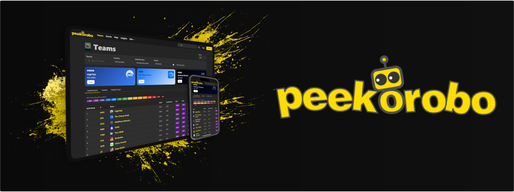

# Peekorobo

Data-driven scouting and analysis for the [FIRST Robotics Competition](https://www.firstinspires.org/robotics/frc). Peekorobo aggregates The Blue Alliance data, computes **ACE** (Adjusted Contribution Estimate) ratings, and serves teams, events, matches, maps, insights, and more.

**Live:** [peekorobo.pages.dev](https://www.peekorobo.com/) · **API:** [peekorobo-api.onrender.com](https://peekorobo-db-bec52087b7e6.herokuapp.com/docs)

---

## Table of contents

1. [Features](#features)
2. [ACE algorithm](#ace-algorithm)
3. [Architecture & stack](#architecture--stack)
4. [License](#license)

---

## Features

### Home

<!-- Screenshot: Home -->
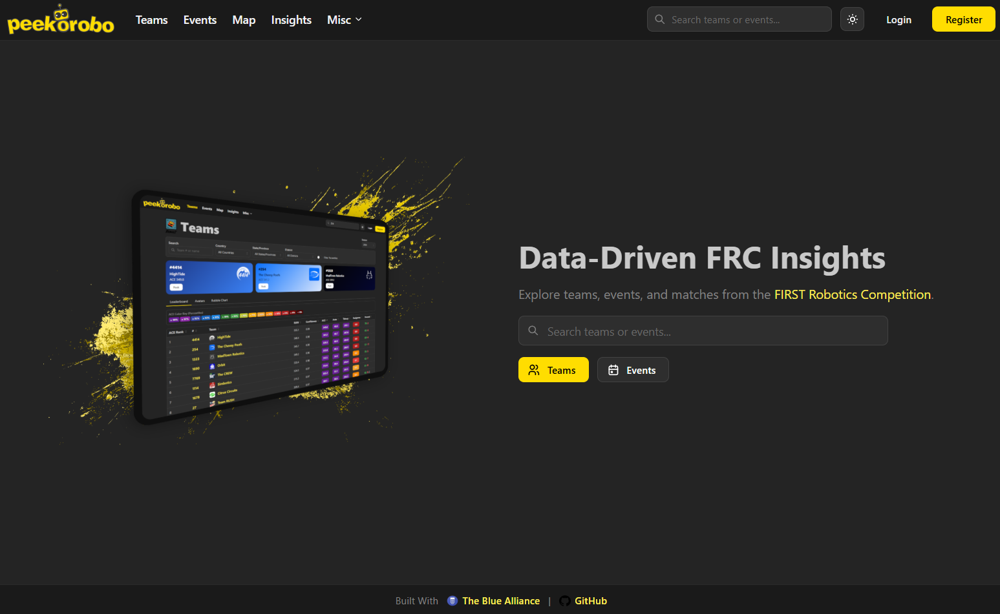

### Teams leaderboard

Browse every team for a season with:

- **Leaderboard** — sortable/paginated table (ACE, RAW, phase scores, record, ranks); export CSV/JSON; shareable URL filters (`year`, `country`, `state`, `district`)
- **Avatars** — grid of team avatars
- **Bubble chart** — configurable X/Y/color metrics, quantile bands, median lines, tooltips
- Fast first paint (top ~100), then full-season load on filter/pagination

<!-- Screenshot: Teams leaderboard -->
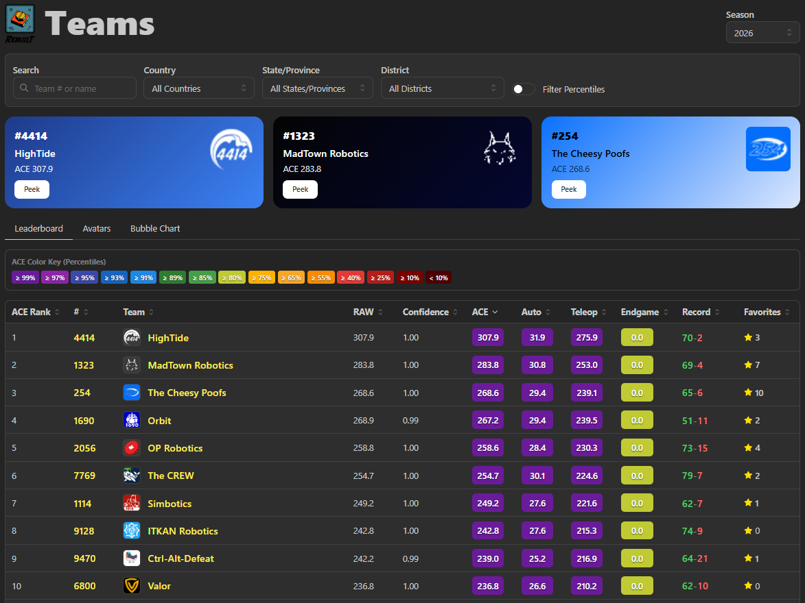

<!-- Screenshot: Teams bubble chart -->
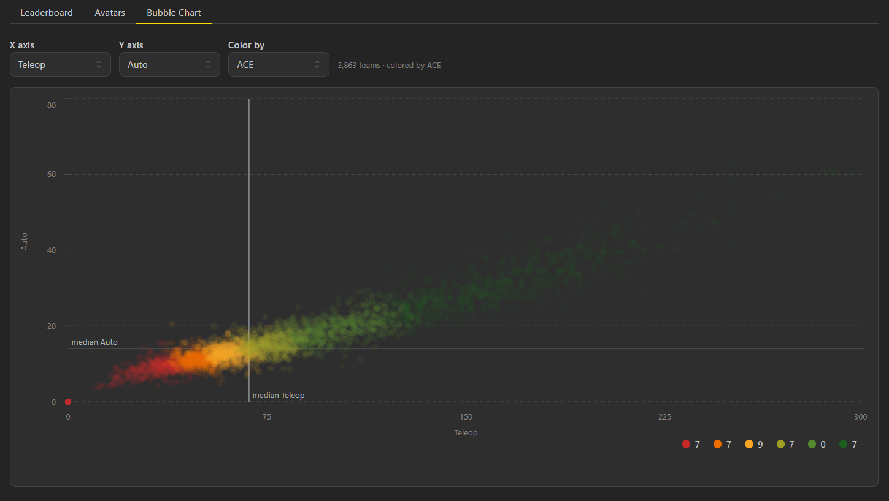

### Team profile

Per-season team page (`/team/:number/:year`) with:

- Header gradient from team colors, avatar, notables (e.g. Hall of Fame / championship impact)
- Rank cards (global / country / state / district) linking to filtered leaderboards
- Links to TBA, Statbotics, and official FRC
- Season selector and career **History** page
- Tabs: **Overview** (ACE/RAW pills, recent events, performance chart), **Events**, **Awards** (blue banners first, then other awards)

<!-- Screenshot: Team profile -->
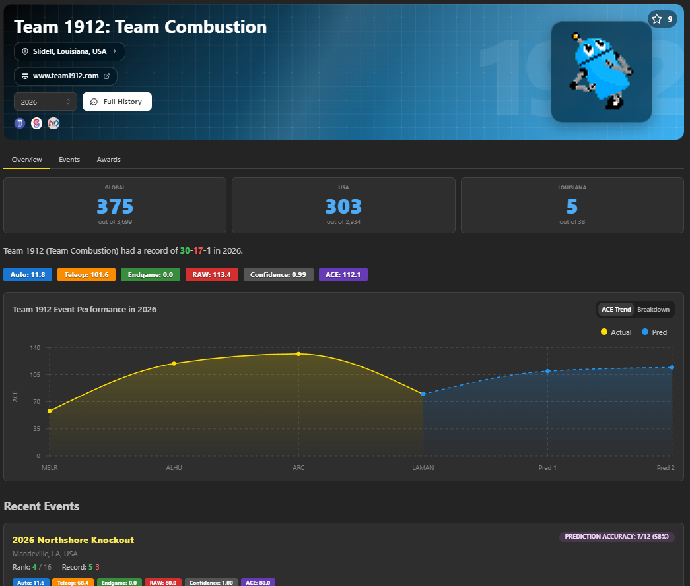

### Team history

Career view (`/team/:number/history`): summary stats, blue banners wall, global rank-by-season chart (ACE in hover — rank is comparable across years; ACE units are not).

<!-- Screenshot: Team history -->
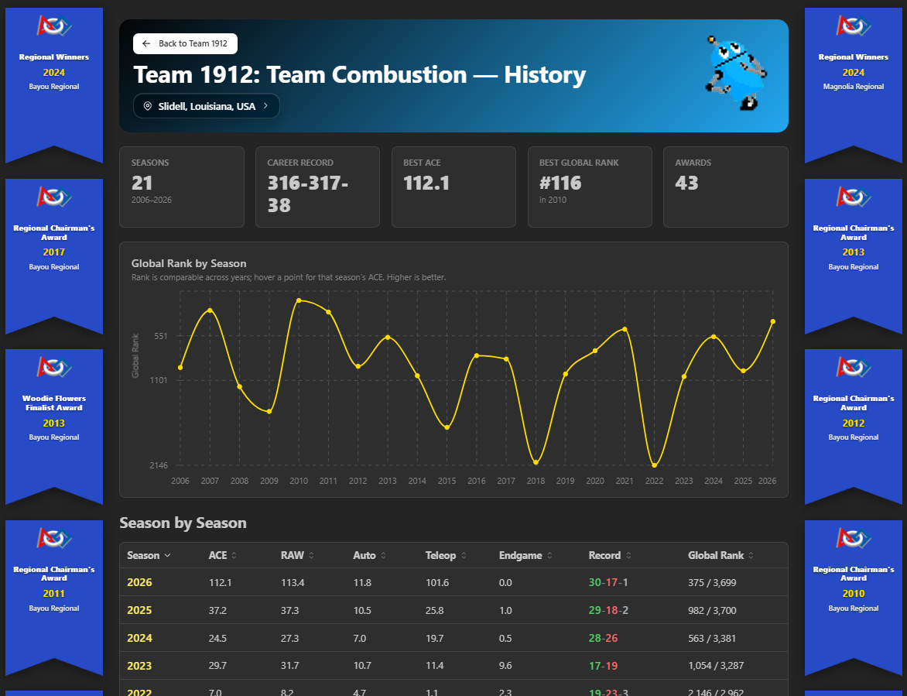

### Events browser

Season event list with week / type / district filters, shareable URLs, game-logo header, and an **Event Metrics** tab with season-wide event statistics.

<!-- Screenshot: Events -->
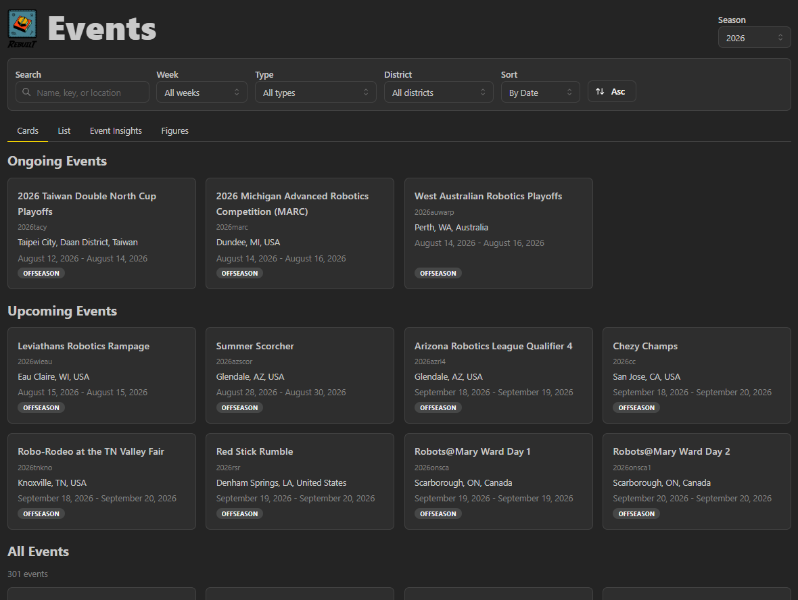

### Event detail

Event page (`/event/:key`) tabs:

| Tab | Contents |
|-----|----------|
| **Teams** | Event roster with ACE and records |
| **Metrics** | Per-team ACE/RAW/auto/teleop/endgame; toggle event vs season metrics |
| **Matches** | Qual + playoff tables (paginated), colored W-L-T |
| **SoS** | Strength of schedule (client-side from matches + event ACE) |
| **Rankings** | Qual rankings (W/L/T/DQ, ACE, event ACE rank) + playoff bracket |
| **Awards** | Grouped award cards |

<!-- Screenshot: Event detail -->
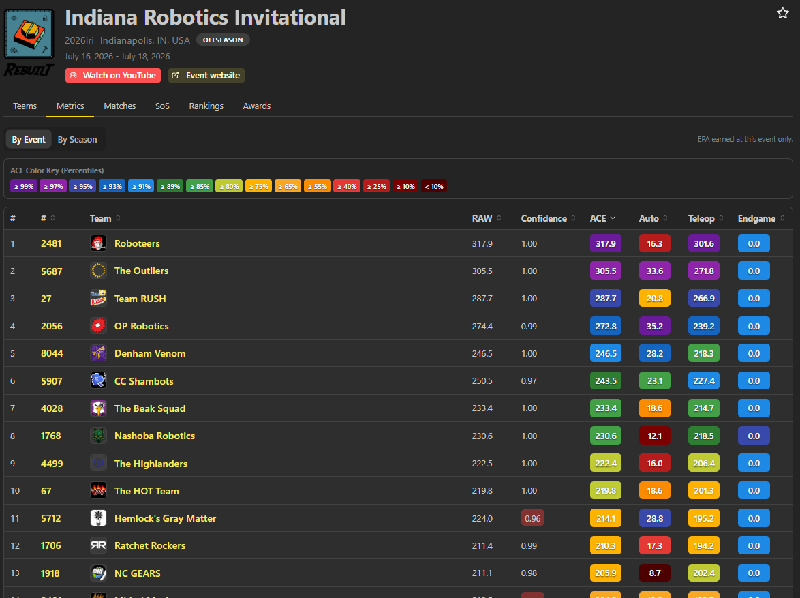

### Match detail

Alliance breakdown, scores, win probabilities (when available), navigation to adjacent matches, team number links (not names in tables).

<!-- Screenshot: Match -->
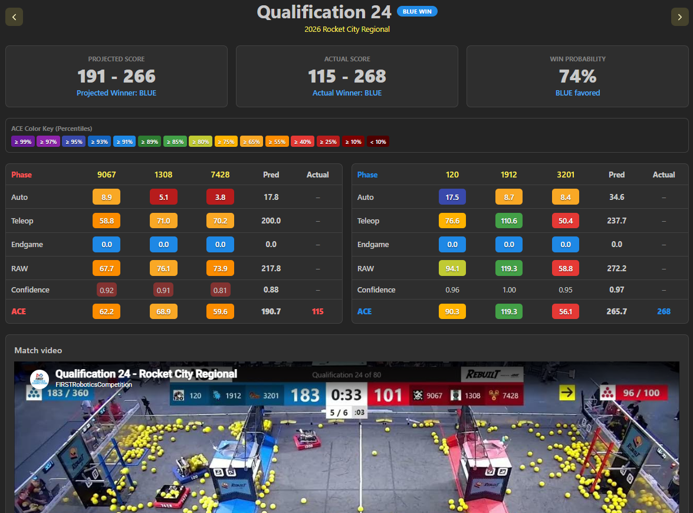

### Map

Full-bleed interactive map (MapLibre GL):

- Team avatar markers + event markers (by type)
- Optional heatmap and district boundaries
- 2D / 3D globe toggle
- Search to fly to a team or event
- Collapsible layer controls

<!-- Screenshot: Map -->
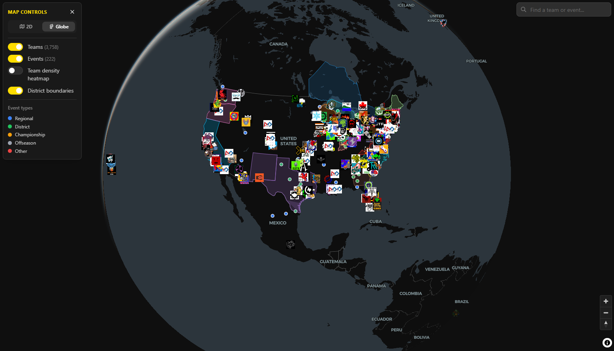

### Compare

Side-by-side team comparison for a chosen year (metrics, records, ranks).

<!-- Screenshot: Compare -->
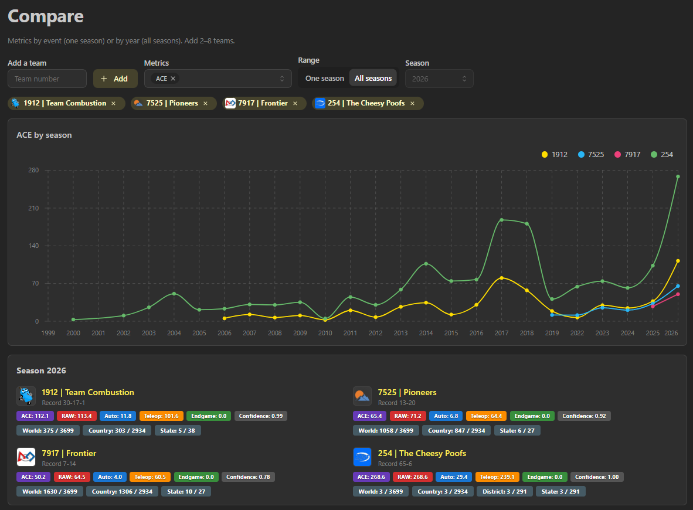

### Insights

Season cards landing page, then per-year insights: game info, manuals/reveal links when available, leaderboards and season summaries.

<!-- Screenshot: Insights -->
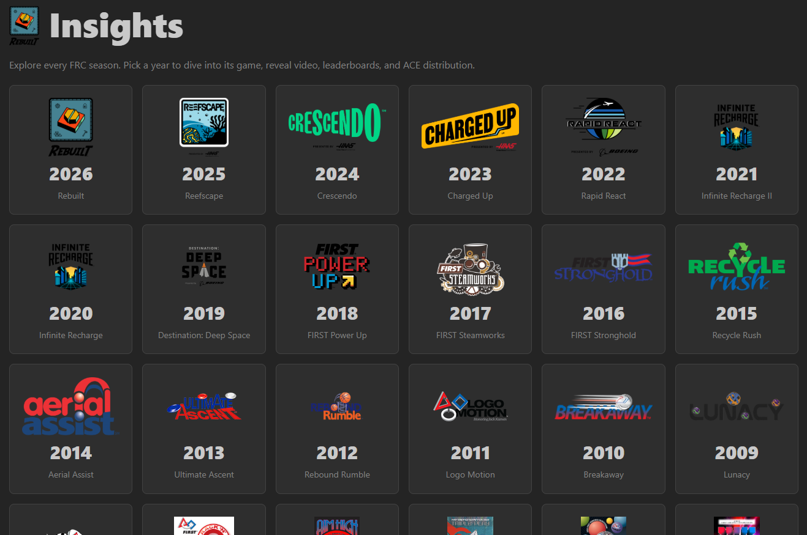

### Accounts & social

Register / login (JWT), profile page with avatar gallery, favorites, follows, API key management, and public user profiles.

<!-- Screenshot: Profile -->
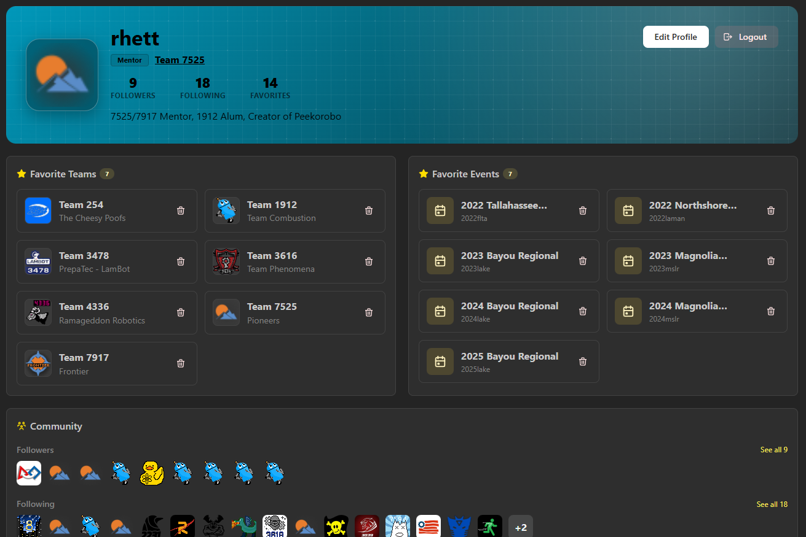

---

## ACE algorithm

**ACE** (Adjusted Contribution Estimate) is Peekorobo's contribution rating:

$$
\mathrm{ACE} = \mathrm{RAW} \times \mathrm{confidence}
$$

RAW estimates how many points a team contributes. Confidence scales that by how trustworthy the estimate is.

### Phase totals

Each alliance score is split into auto, teleop, and endgame from TBA `score_breakdown`:

$$
S_{\mathrm{auto}} = \mathrm{autoPoints},\quad
S_{\mathrm{end}} = \text{(year-specific endgame)},\quad
S_{\mathrm{teleop}} = \mathrm{totalPoints} - S_{\mathrm{auto}} - S_{\mathrm{end}}
$$

so $S_{\mathrm{auto}} + S_{\mathrm{teleop}} + S_{\mathrm{end}} = \mathrm{totalPoints}$. Fouls and adjustments are absorbed into teleop. Phases are floored at zero.

### Residual attribution

Within an event, played matches are walked in time order. For a shared phase with alliance total $S$ and $n$ robots, team $i$ with partners $j,k$ gets observation

$$
\mathrm{obs}_i = S - r_j - r_k
$$

(cold partners use equal share $S/n$). A light shrink blends toward equal share:

$$
\mathrm{obs}_i \leftarrow (1-\alpha)\,\mathrm{obs}_i + \alpha\,\frac{S}{n},\quad \alpha \approx 0.05
$$

then $\mathrm{obs}_i = \max(0, \mathrm{obs}_i)$. Per-robot endgame (climb/dock) uses the TBA value directly.

Phase RAW updates with an exponential moving average. The first observation sets $r = \mathrm{obs}$; afterward

$$
r \leftarrow r + K(\mathrm{obs} - r),\quad K = K_0 \cdot w_{\mathrm{early}}
$$

with $K_0 \approx 0.4$ and $w_{\mathrm{early}}$ ramping from ~0.75 to 1 over the first few matches. Qual and playoff matches use the same $K$.

Predicted alliance score is the sum of the three teams' RAW. Events run in season order; each team's final phase RAW seeds the next event as a prior so later events do not cold-start at zero.

**Event RAW** is auto + teleop + endgame after the event. **Event ACE** = event RAW × event confidence.

### Confidence

Event confidence is a weighted mix of five components, then scaled linearly toward a ceiling $\approx 0.88$:

| Component | Weight | Meaning |
|-----------|--------|---------|
| Consistency | 0.35 | Stability of the smoothed (post-EMA) RAW path |
| Dominance | 0.35 | Attributed points vs fair share of alliance score |
| Record | 0.10 | Win rate mapped into $[0.5, 1]$ |
| Veteran | 0.10 | Years of FRC experience |
| Events | 0.10 | Boost from events played this season |

### Season aggregate

Across a team's events, drop empty / zero-RAW events and weight each by chronological weight × match count (early season discounted, late season emphasized):

$$
\mathrm{RAW}_{\mathrm{season}} = \frac{\sum_e w_e\,\mathrm{RAW}_e}{\sum_e w_e},\quad
\mathrm{conf}_{\mathrm{season}} = \frac{\sum_e w_e\,\mathrm{conf}_e}{\sum_e w_e}
$$

$$
\mathrm{ACE}_{\mathrm{season}} = \mathrm{RAW}_{\mathrm{season}} \times \mathrm{conf}_{\mathrm{season}}
$$

W/L/T sum across events. Ranks use season ACE. Unplayed matches get win probabilities from a logistic on ACE (or RAW) differentials.

---

## Architecture & stack

```
The Blue Alliance
      |
      v
GitHub Actions  --ACE pipeline-->  Neon Postgres
      |                                    |
      | static JSON + assets               |
      v                                    v
Cloudflare Pages <---- React SPA ---- FastAPI (Render)
   (SPA + /data + /assets)              (JSON API)
```

| Layer | Tech | Host |
|-------|------|------|
| Frontend | Vite, React, TypeScript, Mantine, TanStack Query, MapLibre | Cloudflare Pages |
| API | FastAPI, SQLAlchemy, JWT auth | Render |
| Database | Postgres | Neon |
| Pipeline | Python (`data/run.py`, rankings, awards, generators) | GitHub Actions |

**Caching:** Public API GETs send `Cache-Control` (~5 min fresh, ~10 min SWR). Auth/favorites are `no-store`. Search indexes and leaderboard snapshots are static files on Pages, regenerated by the full pipeline. The SPA also caches with TanStack Query.

**Read model:** SPA uses public, rate-limited read endpoints. Developers can still use API keys for a dedicated rate-limit bucket (`/docs`, `/authorize`).

---

## Acknowledgments

Match and event data from [The Blue Alliance](https://www.thebluealliance.com/). FIRST and FRC are trademarks of FIRST.

Special thanks to **Patrick A. Phillips** ([@RNGKing](https://github.com/RNGKing)) for helping build the API backend and for his ongoing guidance on the architecture of the site. His contributions have been a huge help in shaping Peekorobo.

## License

See [LICENSE](LICENSE).
