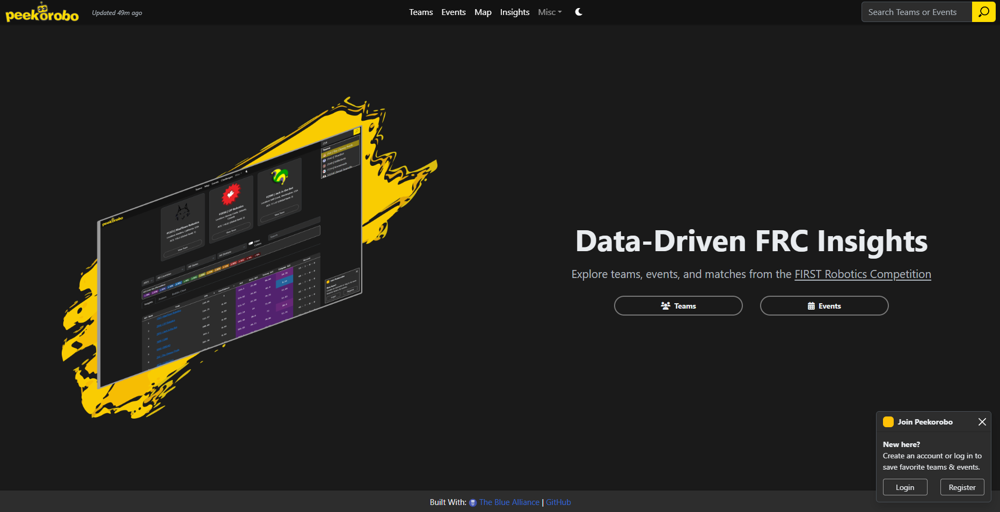
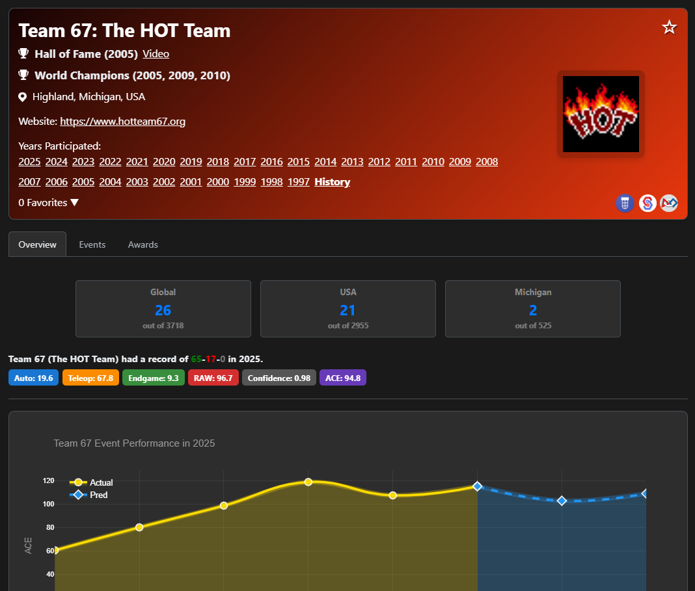
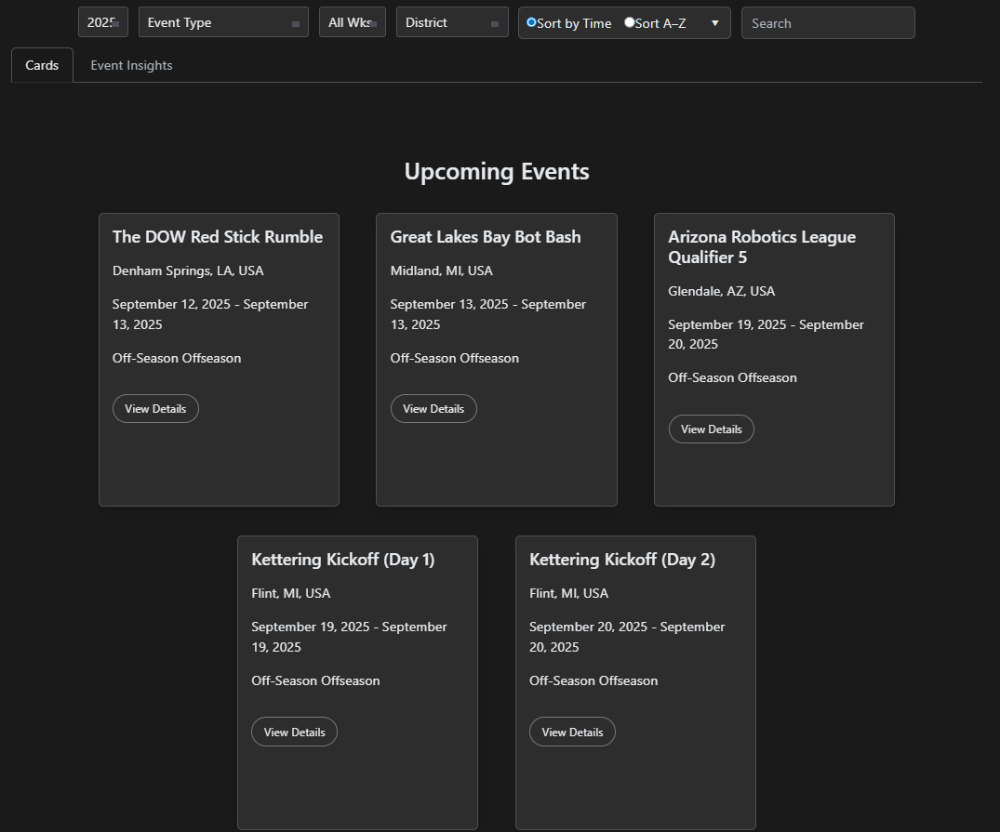
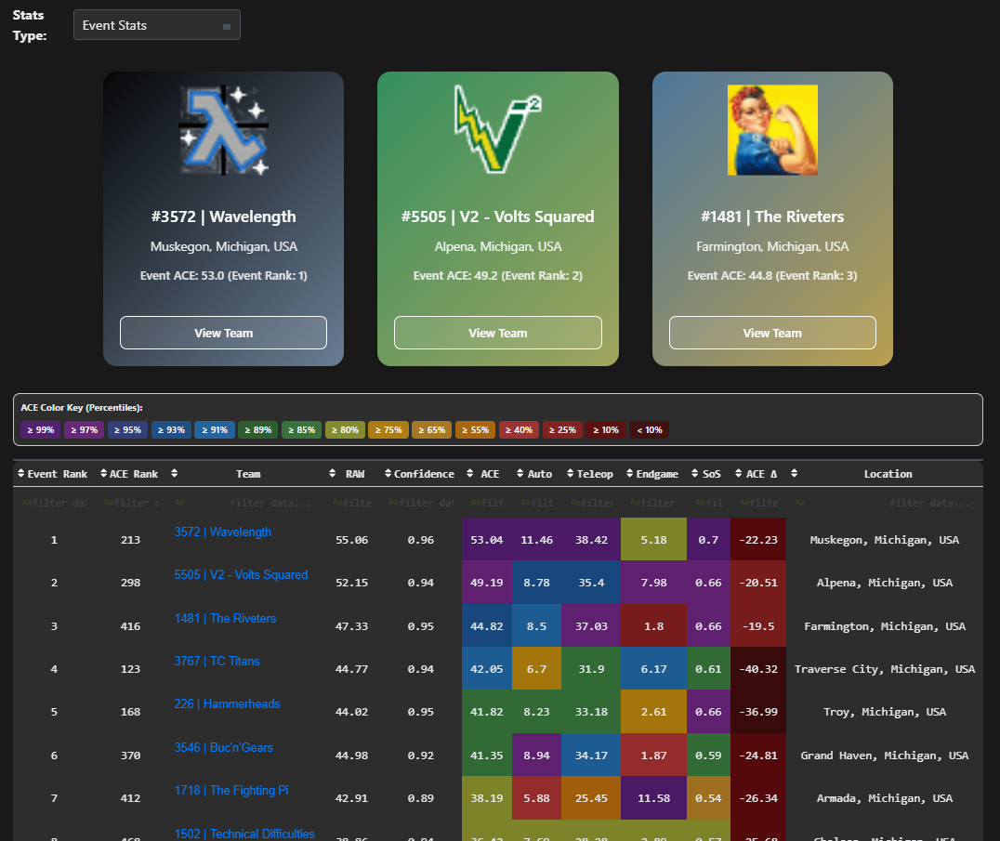
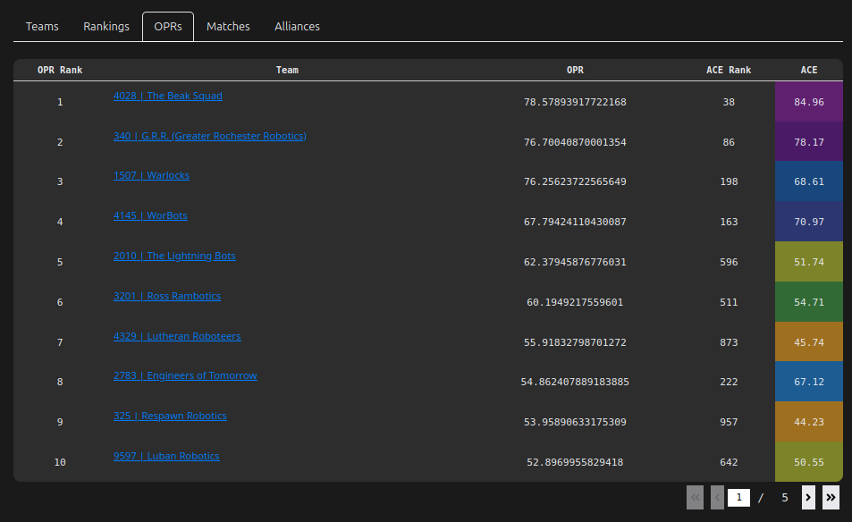

### **Peekorobo is a comprehensive web application for analyzing FRC team performance, leveraging data from The Blue Alliance (TBA) and a custom contribution estimation model called the ACE algorithm. It offers insights into team rankings, match performance, historical trends, and event dynamics.**

---

## Table of Contents
1.  [Features](#features)
    *   [Home Page](#home-page)
    *   [Global Search](#global-search)
    *   [Team Profiles](#team-profiles)
    *   [Teams Dictionary](#teams-dictionary)
    *   [Events Dictionary](#events-dictionary)
    *   [Event Details](#event-details)
    *   [Challenges](#challenges)
    *   [Team Map](#team-map)
    *   [User Authentication](#user-authentication)
    *   [User Profiles](#user-profiles)
    *   [Theme Toggle](#theme-toggle)
    *   [Universal Profile Icon/Toast](#universal-profile-icontoast)
2.  [ACE (Adjusted Contribution Estimate) Algorithm](#ace-adjusted-contribution-estimate-algorithm)
    *   [Core Model](#core-model)
    *   [Component Estimation](#component-estimation)
    *   [Confidence Calculation](#confidence-calculation)
    *   [Key Components](#key-components)
5.  [License](#license)

---

## Features

### Home Page

The landing page provides a brief introduction to Peekorobo and a central search bar to quickly find teams or events.



### Team Profiles

Each team has a dedicated profile page displaying detailed information for a selected year (or historical overview).

*   **General Info**: Team number, nickname, location (city, state, country), rookie year, and website. Notable achievements like Hall of Fame or World Championships are highlighted.
*   **Years Participated**: Links to view the team's profile for specific past seasons.
*   **Performance Metrics**: Detailed breakdown of the team's performance based on the ACE model, including:
    *   Overall ACE and EPA (Estimated Points Added)
    *   Component breakdown: Auto ACE, Teleop ACE, Endgame ACE
    *   Global, Country, and State/Province ranks (clickable links to the Teams Dictionary filtered view)
    *   Season win/loss/tie record.
    *   ACE component pills with color coding based on percentile rank relative to all teams in the selected year.
*   **Recent Events**: A section showcasing the team's most recent event performances with key stats and match outcomes.
*   **Event History Table**: A searchable and filterable table listing all events the team participated in during the selected year (or across history), including event name, location, and dates.
*   **Awards Table**: A table listing all awards the team received in the selected year (or across history), including award name, event name, and year.
*   **Blue Banners**: A visual display of blue banners won by the team, with links to the corresponding events.
*   **Favorite Button**: Authenticated users can favorite teams to easily access them from their user profile.



### Teams Dictionary

Explore and compare all teams within a given year.

*   **Filtering**: Filter teams by year, country, state/province, and district.
*   **Search**: Interactive search bar to filter teams by number, name, or location.
*   **Top 3 Spotlight**: Highlights the top 3 teams based on ACE with dedicated cards.
*   **Main Table**: A detailed table displaying teams with columns for ACE Rank, ACE, EPA (unweighted), Confidence, and the component breakdowns (Auto ACE, Teleop ACE, Endgame ACE), Location, and Record.
*   **ACE Color Key**: A legend explaining the color coding used for ACE and its components, based on percentiles. Users can toggle between global percentiles (all teams) and filtered percentiles (teams matching current filters).
*   **Avatars Gallery**: A separate tab displaying all team avatars for the filtered set of teams.
*   **Bubble Chart**: A visual representation of team performance plotting two chosen ACE components against each other, with bubble size potentially representing overall ACE. Useful for identifying specialists (high on one axis) or well-rounded teams (balanced on both axes). Users can select which components to plot on the X and Y axes.


### Events Dictionary

Browse and filter FRC events across different years.

*   **Filtering**: Filter events by year, event type (Season, Off-season, Regional, District, Championship), week number, and district.
*   **Search**: Interactive search bar to filter events by name or code.
*   **Sorting**: Toggle between sorting events by time (start date) or alphabetically by name.
*   **Card View**: Displays events as interactive cards showing key details and a favorite button for logged-in users. Includes separate sections for Upcoming and Ongoing events.
*   **Event Insights Table**: A tabular view providing insights into the competitive strength of events, showing Max ACE, Top 8 ACE, and Top 24 ACE for teams participating in each event. Color-coded based on percentiles for comparison.




### Event Details

A dedicated page for each FRC event providing in-depth information.

*   **Header**: Event name, year, location, dates, type, website link, and a favorite button. Includes a thumbnail link to the event's YouTube match video if available.
*   **Data Tabs**: Switch between different views of event data:
    *   **Teams**: Lists all teams participating in the event, sorted by ACE Rank, with ACE and component breakdowns. Includes a spotlight of the top teams at the event.
    *   **Rankings**: Displays the official event rankings (Rank, Wins, Losses, Ties, DQ) alongside ACE Rank and ACE for comparison.
    *   **OPRs**: Shows OPR (Offensive Power Rating) for teams at the event, alongside their ACE Rank and ACE.
    *   **Matches**: Lists all matches played at the event, including Red/Blue alliances, scores, winner, and a calculated win prediction based on ACE. Includes links to match videos and can be filtered by a specific team.
    *   **Alliances**: Displays the alliance selection results for the event in a table and a tree graph, showing alliance captains and their picks.






### Challenges

Explore the history of FRC games year by year.

*   **Challenge Dictionary**: Lists all FRC challenges from 1992 to the present, with names, years, and logos.
*   **Challenge Details**: Clicking on a challenge leads to a page with a summary of the game, links to the official game manual, and the game reveal video.


### Team Map

Visualize the geographic distribution of FRC teams for a given year on an interactive map.


### User Authentication

Users can register for a new account or log in to save favorite teams and events, and customize their profile.

### User Profiles

Authenticated users have a profile page.

*   **My Profile**: Displays user information (username, role, team affiliation, bio, avatar, card background color), favorite team and event counts, and lists of followers and following. Allows editing profile details and selecting an avatar from a gallery.
*   **Favorite Teams/Events**: Lists the teams and events the user has favorited, with direct links and an option to remove them.
*   **Other User Profiles**: View profiles of other users, see their favorited teams/events, and follow/unfollow them.
*   **User Search**: Search for other users by username.


### Theme Toggle

Switch between light and dark mode for a personalized viewing experience.

### Universal Profile Icon/Toast

A small icon is shown in the bottom right for logged-in users, linking to their profile. For logged-out users, a dismissible toast encourages registration/login to use favorite features.

### Global Search

A search bar is available in the top navigation bar on most pages, allowing quick searches for teams, events, or users.

---

## ACE (Adjusted Contribution Estimate) Algorithm

The core of Peekorobo's statistical analysis is the ACE model, which builds upon the traditional EPA (Estimated Points Added) concept. It aims to provide a more robust measure of a team's expected contribution to a match by incorporating factors beyond just raw scoring potential.

The EPA model is an incremental update system, similar to Elo rating systems, where a team's EPA changes after each match based on the difference between their actual contribution and their expected contribution. ACE refines this by introducing a Confidence score.

### Core Model

EPA updates are done incrementally after each match. Auto, Teleop, and Endgame contributions are calculated separately, then EPA is updated using a weighted delta with decay.

```
# For each component (auto, teleop, endgame):
delta = decay * K * (actual - epa)

# Where:
decay = world_champ_penalty * (match_count / total_matches)²
K = 0.4 * match_importance * world_champ_penalty

# World Championship penalties:
Einstein: 0.95
Division: 0.85
Regular: 1.0

# Match importance weights:
importance = {"qm": 1.1, "qf": 1.0, "sf": 1.0, "f": 1.0}
```

The decay factor ensures that recent matches have a stronger influence on EPA updates. The square of the `match_count / total_matches` term accelerates this decay as a team plays more matches. World Championship penalties slightly dampen the impact of matches at those high-level events. The `K` factor is a constant learning rate, adjusted by match importance (Quals are slightly more weighted to reduce alliance bias introduced in playoffs).

### Component Estimation

Each component (Auto, Teleop, Endgame) score for a match is estimated separately from the score breakdown data. To mitigate the impact of outlier "hot" matches or anomalies, an adaptive trimming method is applied to the history of a team's component scores.

```
# Trimming percentages based on match count:
< 12 matches: 0%
< 25 matches: 3%
< 40 matches: 5%
< 60 matches: 8%
< 100 matches: 10%
≥ 100 matches: 12%

# Trim from low end only:
trimmed_scores = sorted(scores)[k:]  # k = n * trim_pct
```

This method trims a percentage of the lowest scores from the team's history, with the percentage increasing with the number of matches played. This provides a more stable estimate of a team's consistent performance for that component.

### Confidence Calculation

ACE = EPA × Confidence. The Confidence score is a weighted average of several components designed to measure the reliability and context of a team's performance.

```
weights = {
    "consistency": 0.4,
    "dominance": 0.25,
    "record_alignment": 0.15,
    "veteran": 0.1,
    "events": 0.05,
    "base": 0.05
}

# Components:
consistency = 1 - (stdev / peak_score)
dominance = mean(normalized_margin_scores)
record_alignment = 1 - |expected_win_rate - actual_win_rate|
veteran_bonus = 1.0 if veteran else 0.6
event_boost = 1.0 if events ≥ 2 else 0.60

confidence = min(1.0, sum(weight * component))
```

The raw confidence score is a sum of weighted component scores, capped at 1.0.

### Key Components

Each confidence component measures a different aspect of team performance:

*   **Consistency (40%)**: Measures stability of match-to-match performance. Higher when scores are more consistent relative to peak performance. \( \text{Consistency} = 1 - \frac{\text{standard deviation of scores}}{\text{peak score}} \)
*   **Dominance (25%)**: Measures how much a team outperforms opponents. Calculated from the mean of normalized margin scores across matches.
*   **Record Alignment (15%)**: How well the actual win rate matches the expected win rate derived from dominance scores. \( \text{Record Alignment} = 1 - |\text{expected win rate} - \text{actual win rate}| \)
*   **Veteran Status (10%)**: Veteran teams start with higher confidence (1.0 vs 0.6 for rookies) due to historical predictability.
*   **Event Count (5%)**: Teams participating in two or more events receive a confidence boost (1.0 vs 0.6).
*   **Base Confidence (5%)**: Provides a minimum confidence floor to prevent extreme penalties from other factors.

The full model is continuously evolving and improving. To contribute, test ideas, or file issues, visit the GitHub repository.

---

You can visit Peekorobo here:

https://peekorobo.com

---

## License

Peekorobo is licensed under the **MIT License**. See the LICENSE file for details.

Copyright (c) 2024 Rhett R. Adam

---
