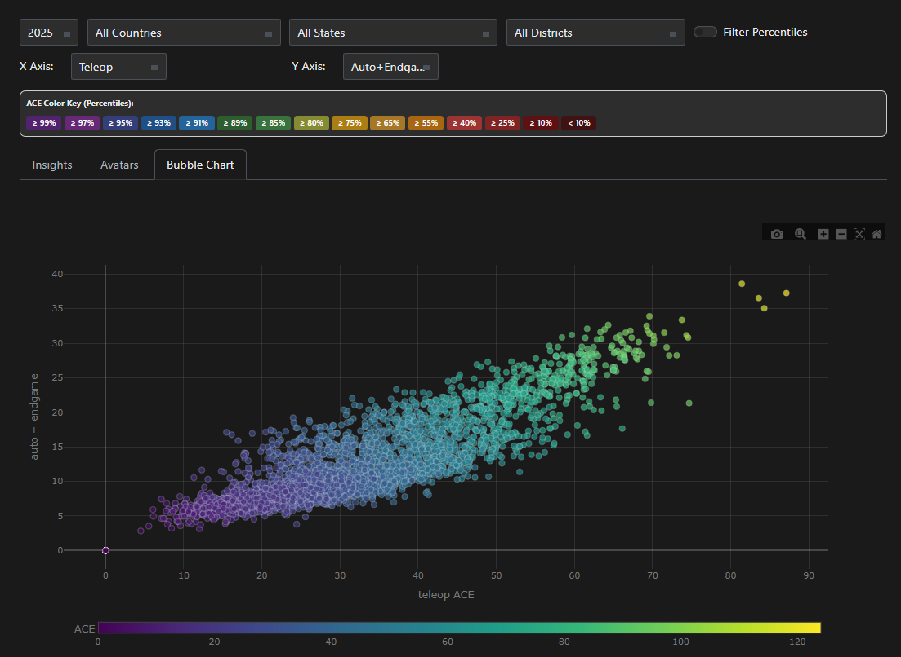
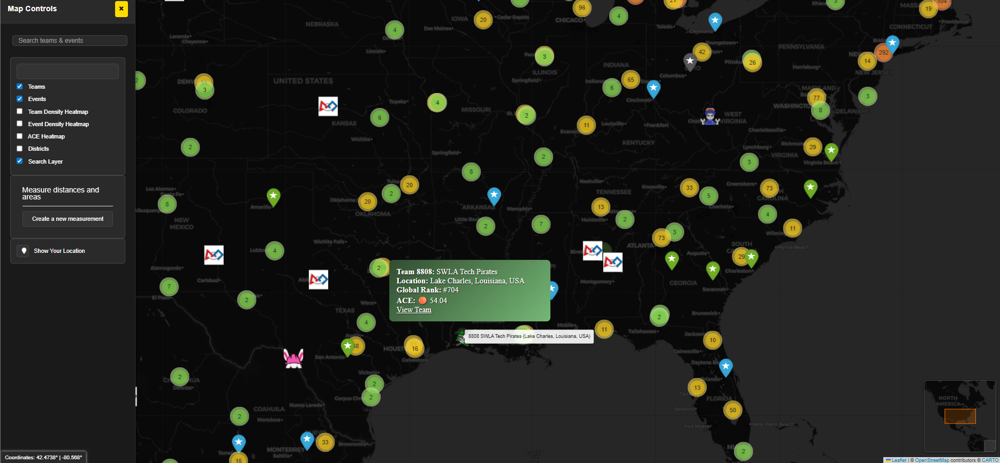

### **Peekorobo is a comprehensive web application for analyzing FRC team performance, leveraging data from The Blue Alliance (TBA) and a contribution estimation model called the ACE algorithm. It offers rich insights into team rankings, match performance and predictions, strength of schedule, historical trends, and event dynamics.**

---

## Table of Contents
1.  [Features](#features)
    *   [Home Page](#home-page)
    *   [Team Profiles](#team-profiles)
    *   [Teams](#teams)
    *   [Events](#events)
    *   [Event Details](#event-details)
    *   [Challenges](#challenges)
    *   [Team Map](#team-map)
    *   [User Profiles](#user-profiles)
2.  [ACE (Adjusted Contribution Estimate) Algorithm](#ace-adjusted-contribution-estimate-algorithm)
    *   [Core Model](#core-model)
    *   [Component Estimation](#component-estimation)
    *   [Confidence Calculation](#confidence-calculation)
    *   [Season Aggregation & Weighting](#season-aggregation--weighting)
    *   [Key Components](#key-components)
5.  [License](#license)

---

## Features

### Home Page

- **Global search preview**: As you type, you’ll see categorized suggestions for Teams, Events, and Users with smart highlighting of closest matches, recent years, and quick links.


### Team Profiles

Each team has a dedicated profile page displaying detailed information for a selected year (or historical overview).

*   **General Info**: Team number, nickname, location (city, state, country), rookie year, and website. Notable achievements like Hall of Fame or World Championships are highlighted.
*   **Years Participated**: Links to view the team's profile for specific past seasons.
*   **Performance Metrics**: Detailed breakdown of the team's performance based on the ACE model, including:
    *   Overall ACE and RAW
    *   Component breakdown: Auto ACE, Teleop ACE, Endgame ACE
    *   Global, Country, and State/Province ranks (clickable links to the Teams insights filtered view)
    *   Season win/loss/tie record.
    *   ACE component pills with color coding based on percentile rank relative to all teams in the selected year.
*   **Recent Events**: A section showcasing the team's most recent event performances with key stats and match outcomes.
*   **Event History Table**: A searchable and filterable table listing all events the team participated in during the selected year (or across history), including event name, location, and dates.
*   **Awards Table**: A table listing all awards the team received in the selected year (or across history), including award name, event name, and year.
*   **Blue Banners**: A visual display of blue banners won by the team, with links to the corresponding events.
*   **Favorite Button**: Authenticated users can favorite teams to easily access them from their user profile.


### Teams

Explore and compare all teams within a given year.

*   **Filtering**: Filter teams by year, country, state/province, and district.
*   **Search**: Interactive search bar to filter teams by number, name, or location.
*   **Top 3 Spotlight**: Highlights the top 3 teams based on ACE with dedicated cards.
*   **Main Table**: A detailed table displaying teams with columns for ACE Rank, ACE, RAW (unweighted), Confidence, and the component breakdowns (Auto ACE, Teleop ACE, Endgame ACE), Location, and Record. Favorite counts are also shown with subtle highlighting at configurable thresholds.
*   **Exports**: Download the current or selected rows as CSV, TSV, Excel, JSON, HTML, or LaTeX.
*   **ACE Color Key**: A legend explaining the color coding used for ACE and its components, based on percentiles. Users can toggle between global percentiles (all teams) and filtered percentiles (teams matching current filters).
*   **Avatars Gallery**: A separate tab displaying all team avatars for the filtered set of teams.
*   **Bubble Chart**: A visual representation of team performance plotting two chosen ACE components against each other, with bubble size potentially representing overall ACE. Useful for identifying specialists (high on one axis) or well-rounded teams (balanced on both axes). Users can select which components to plot on the X and Y axes.




### Events

Browse and filter FRC events across different years.

*   **Filtering**: Filter events by year, event type (Season, Off-season, Regional, District, Championship), week number, and district.
*   **Search**: Interactive search bar to filter events by name or code.
*   **Sorting**: Toggle between sorting events by time (start date) or alphabetically by name.
*   **Card View**: Displays events as interactive cards showing key details and a favorite button for logged-in users. Includes separate sections for Upcoming and Ongoing events.
*   **Event Insights Table**: A tabular view providing insights into the competitive strength of events, showing Max ACE, Top 8 ACE, and Top 24 ACE for teams participating in each event. Color-coded based on percentiles for comparison.


### Event Details

A dedicated page for each FRC event providing in-depth information.

*   **Header**: Event name, year, location, dates, type, website link, and a favorite button. Includes a thumbnail link to the event's YouTube match video if available.
*   **Data Tabs**: Switch between different views of event data:
    *   **Teams**: Lists all teams participating in the event, sorted by ACE Rank, with ACE and component breakdowns. Includes a spotlight of the top teams at the event. A Stats Type selector lets you switch between Overall season metrics and Event-specific metrics; event stats include SoS and ACE Δ versus season baselines.
    *   **Rankings**: Displays the official event rankings (Rank, Wins, Losses, Ties, DQ) alongside ACE Rank and ACE for comparison.
    *   **Matches**: Lists all matches played at the event, including Red/Blue alliances, scores, winner, and win predictions based on ACE and confidence. Toggle between Both Alliances and Team Focus views, filter by team, and create a YouTube playlist of selected matches with one click. Inline accuracy badges summarize prediction performance, and an Event Insights card surfaces high/low scores, win margins, and handy match links.
    *   **SoS**: Strength of Schedule table per team using average opponent ACE and per-match win probabilities.
    *   **Compare**: Select multiple teams and compare event stats side-by-side, plus a radar chart normalized to the event field.
    *   **Metrics**: Explore TBA metrics via a dropdown (OPRs, DPRs, CCWMs, COPRs variants). Results are sortable and link back to team pages.
    *   **Alliances**: Visual bracket-style cards that show alliance captains/picks and playoff progression/status pulled from TBA.


### Challenges

Explore the history of FRC games year by year.

*   **Challenge Dictionary**: Lists all FRC challenges from 1992 to the present, with names, years, and logos.
*   **Challenge Details**: Clicking on a challenge leads to a page with a summary of the game, links to the official game manual, and the game reveal video.


### Team Map

Visualize the geographic distribution of FRC teams for a given year on an interactive map.



### User Authentication

Users can register for a new account or log in to save favorite teams and events, and customize their profile.

### User Profiles

Authenticated users have a profile page.

*   **My Profile**: Displays user information (username, role, team affiliation, bio, avatar, card background color), favorite team and event counts, and lists of followers and following. Edit your profile (including picking an avatar from a gallery and a background color with automatic contrast adjustment).
*   **Favorite Teams/Events**: Lists the teams and events the user has favorited, with direct links and an option to remove them.
*   **Other User Profiles**: View profiles of other users, see their favorited teams/events, and follow/unfollow them with one click.
*   **User Search**: Search for other users by username. Results appear in a compact overlay with follow/unfollow actions and quick links.


### Theme Toggle

Switch between light and dark mode for a personalized viewing experience.

### Universal Profile Icon/Toast

A small icon is shown in the bottom right for logged-in users, linking to their profile. For logged-out users, a dismissible toast encourages registration/login to use favorite features.

---

## ACE (Adjusted Contribution Estimate) Algorithm

The core of Peekorobo's statistical analysis is the ACE model. It aims to provide a more robust measure of a team's expected contribution to a match by incorporating factors beyond just raw scoring potential.

The RAW model is an incremental update system, similar to Elo rating systems, where a team's RAW contribution changes after each match based on the difference between their actual contribution and their expected contribution. ACE refines this by introducing a Confidence score.

### Core Model

RAW updates are done incrementally after each match. Auto, Teleop, and Endgame are computed per match, and each component RAW output is nudged toward the observed value using a constant learning rate scaled by match importance. The first observed match initializes the component RAW outputs to the observed values.

```
# For each component c ∈ {auto, teleop, endgame}
delta_c = K * importance[comp_level] * (actual_c - raw_c)
K = 0.4
importance = {"qm": 1.1, "qf": 1.0, "sf": 1.0, "f": 1.0}

# Overall RAW is the sum of component RAW outputs after the update
overall_raw = auto_raw + teleop_raw + endgame_raw
```

No separate time-decay or championship penalties are applied in the current implementation.

### Component Estimation

- **Modern seasons (with `score_breakdown`)**: Component values are derived via year-specific scoring functions (from `data/yearmodels.py`). Auto and Teleop are computed from the match breakdowns; Endgame uses either the alliance breakdown or team index depending on the year’s scoring model. Opponent strength is normalized on a per-team basis to build a margin signal.
- **Legacy seasons (≤ 2014, no `score_breakdown`)**: Falls back to alliance score, scaled by alliance size using a logarithmic factor to approximate per-team contribution. This path also computes a normalized margin versus the opponent alliance.

### Confidence Calculation

ACE is defined as Season/Event Overall × Confidence. Confidence blends stability, competitive dominance, record alignment, veteran status, and event count, with a mild non-linear scaling at extremes.

```
# Weights (from implementation)
weights = {
  "consistency": 0.35,
  "dominance": 0.35,
  "record_alignment": 0.10,
  "veteran": 0.10,
  "events": 0.10,
}

# Components
consistency = 1 - stdev(contributions) / max(contributions)
dominance = mean(normalized_margins)
# Record alignment from W/L only (ties excluded):
#  win_rate = wins / (wins + losses)
record_alignment = 0.7 + 0.3 * win_rate   # ∈ [0.7, 1.0]

# Veteran boost from years of participation up to the given year
#   years ≤ 1 → 0.2, 2 → 0.4, 3 → 0.6, ≥4 → 1.0
veteran_boost ∈ {0.2, 0.4, 0.6, 1.0}

# Event boost from number of events in-season
#   1 event → 0.5, 2 events → 0.9, ≥3 events → 1.0
event_boost ∈ {0.5, 0.9, 1.0}

raw_confidence = Σ weights[k] * component_k

# Non-linear scaling (soften extremes)
if raw_confidence > 0.85:  raw_confidence = 0.85 + 1.1 * (raw_confidence - 0.85)
elif raw_confidence < 0.65: raw_confidence = 0.90 * raw_confidence
confidence = clamp(raw_confidence, 0.0, 1.0)

# Final ACE (a.k.a. displayed season/event contribution)
ACE = overall_raw * confidence
```

Wins/losses are determined directly from alliance scores; matches with a 0 score on either side are treated as ties. (2015 is handled with score-only logic.)

### Season Aggregation & Weighting

When aggregating across multiple events, contributions are weighted by both event timing and match volume:

```
effective_weight(event) = chronological_weight(event_date) * match_count(event)

# chronological_weight (piecewise over the regular season)
preseason  → ≈ 0.05
offseason  → ≈ 0.10
early      → 0.20 → 0.40
midseason  → 0.40 → 0.80
late       → 0.80 → 1.00
```

All component averages, margins, and confidence contributors use these weights. The same non-linear confidence scaling is applied after aggregation.

## Confidence Components

Each component measures a different aspect of team performance:

- **Consistency (35%)**  
  Stability of per-match contributions relative to peak performance.  
  Formula: `Consistency = 1 - stdev/peak`

- **Dominance (35%)**  
  Mean of normalized margins versus the opposing alliance, per team.

- **Record Alignment (10%)**  
  Alignment of actual win rate to a simple record-based target:  
  `0.7 + 0.3 * win_rate`

- **Veteran Status (10%)**  
  Experience-based boost:  
  - `<= 1 year` → **0.2**  
  - `2 years` → **0.4**  
  - `3 years` → **0.6**  
  - `>= 4 years` → **1.0**

- **Event Count (10%)**  
  More events increase reliability:  
  - `1 event` → **0.5**  
  - `2 events` → **0.9**  
  - `>= 3 events` → **1.0**

- **Base Confidence (5%)**  
  Minimum confidence floor to prevent extreme penalties from other factors.

---

The full model is continuously evolving and improving.  
To contribute, test ideas, or file issues, visit the GitHub repository.

You can visit Peekorobo here:

https://www.peekorobo.com/

---

## License

Peekorobo is licensed under the **MIT License**. See the LICENSE file for details.

Copyright (c) 2025 Rhett R. Adam

---
